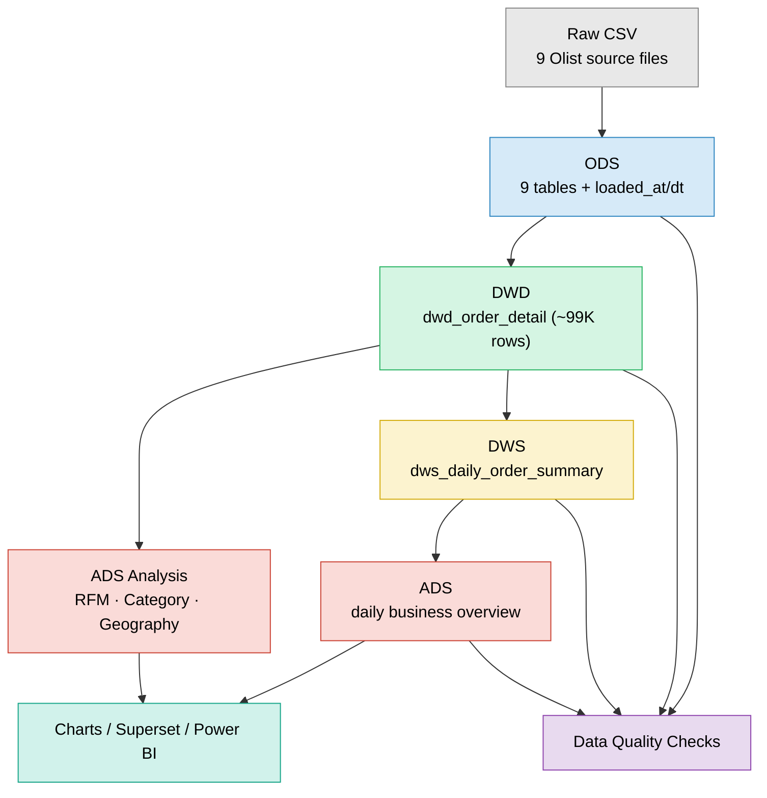
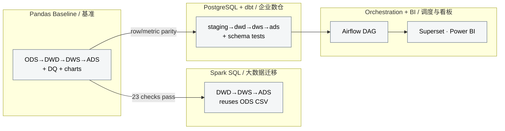
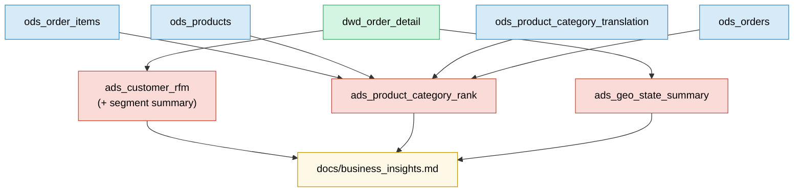

# Architecture & Data Lineage / 架构与数据血缘

This document visualizes the warehouse architecture, the data lineage from raw
files to analysis outputs, and the technology stack. The diagrams use Mermaid and
render directly on GitHub.

本文档以图示展示数仓架构、从原始文件到分析产出的数据血缘，以及技术栈。
图表使用 Mermaid，可在 GitHub 上直接渲染。

---

## 1. Layered Architecture / 分层架构

---

## 2. Multi-Engine Implementation / 多引擎实现

The **same** business logic is implemented across four engines to demonstrate
migration from a local prototype to an enterprise stack. Each is validated against
the Pandas baseline.

**同一套** 业务逻辑在四种引擎上实现，演示从本地原型到企业级技术栈的迁移，
每一套都与 Pandas 基准做校验。

---

## 3. Analysis-Layer Lineage / 分析层血缘

---

## 4. Technology Stack / 技术栈

| Layer / 层 | Tooling / 工具 |
|---|---|
| Storage / 存储 | CSV, PostgreSQL |
| Processing / 处理 | Python + Pandas, PySpark + Spark SQL |
| Modeling / 建模 | dbt (staging → dwd → dws → ads) |
| Orchestration / 调度 | Python pipeline scripts, Apache Airflow |
| Quality / 质量 | Custom DQ checks, dbt schema tests, pytest |
| CI | GitHub Actions (ruff + pytest) |
| BI | matplotlib, Apache Superset, Power BI |
